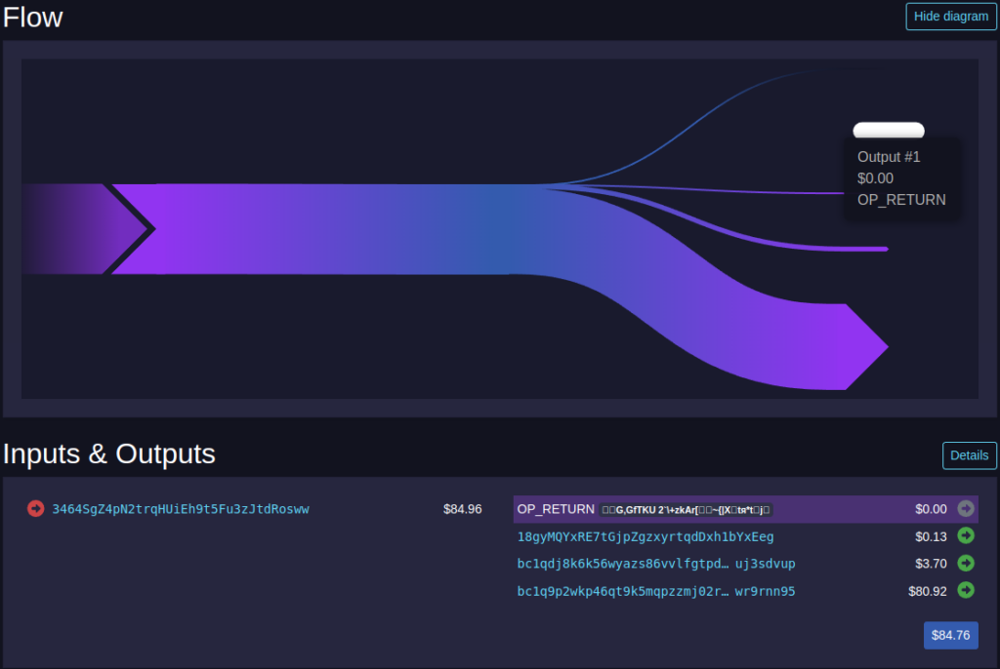

The first proposal to build on [the work of Peter Todd](https://www.mail-archive.com/bitcoin-development@lists.sourceforge.net/msg03613.html) was presented in [BIP 47](https://bips.dev/47/) and ultimately became what we know today as “PayNyms.” BIP 47 iterated on the stealth address proposal by utilizing a single notification transaction to signal to the recipient to watch for payments to a specific public key (and thus set of addresses) instead of including payment code signaling in every payment. While there are multiple versions of BIP 47, as the only one in use is version 1 we will focus on that in this post. For simplicity’s sake, for the rest of this post let’s have “Alice” represent the sender in a transaction, and “Bob” represent the recipient who is using a reusable payment code.

## How it works

When Alice goes to send funds to Bob, her wallet uses the reusable payment code she got from Bob to generate a unique shared secret by combining (1) a private key from an output she owns, (2) the public key in Bob’s reusable payment code, and (3) a 64-byte blinding factor so that only Bob can interpret the shared secret. Alice’s wallet then converts this payment code to binary and inserts it into this notification transaction’s OP_RETURN field in order to let Bob know where to expect future payments from her.

Both Alice and Bob have to be extremely careful not to link this notification transaction (or the inputs or outputs) with other transactions, as that could provide an on-chain link between their wallets and undo privacy gained from using BIP 47 reusable payment codes. Thankfully, current implementations in Samourai and Sparrow Wallet hide this “toxic” output associated with the notification transaction by default to protect both sender and recipient.

When Bob wants to check for received funds, he monitors his notification address, and when a transaction is received to it he (1) validates that it includes a BIP 47 payment code, (2) decrypts it with his private key, and then (3) stores the information on the set of addresses Alice can send to and watches them like any normal Bitcoin wallet. Even though this notification code is publicly visible on the blockchain, it is encrypted in such a way that only Bob can deduce the addresses it is used to generate, and thus all of Alice’s future payments are known only to Bob. Alice can now send as many payments as she would like to a unique address every time, and Bob can easily watch for new payments with both “light” wallets and “full” wallets.

## Advantages and trade-offs

### Advantages over Silent Payments

- Broader support (as of May 2024)
  - BIP 47 holds the unique status of being the only form of reusable payment code to actually be implemented and widely used thanks to the efforts of the Samourai Wallet team, who have implemented BIP 47 as “PayNyms.”
  - BIP 47 payment codes are leveraged in Samourai Wallet, [Sparrow Wallet](https://www.sparrowwallet.com/), and [Stack Wallet](https://stackwallet.com/) today.
- Easier wallet scanning
  - As a receiver is notified on-chain of what derivation path will be used for payments, he can easily pre-generate many possible addresses and check them using a standard Electrum server or BIP 158 filter. This requires less bandwidth and compute compared to Silent Payments scanning, both for the back-end and the user's wallet itself.

## Trade-offs versus Silent Payments

- Worse sender privacy
  - Senders in the widely used form of BIP 47 are required to send a notification transaction on-chain to a static, publicly known on-chain address of the recipient. This notification transaction makes scanning easier, but also leaks immense amounts of data and makes it publicly visible when someone is signaling that they will pay a specific BIP 47 reusable payment code.
  - As each subsequent send after notification matches the derivation path of a specific notification transaction, the recipient can easily connect all payments back to a single payee.
  - Sender privacy is also harmed as the sender's payment code is included in the notification transaction, which while useful for refunds it also links their payment code with the person they're paying. If the sender ever publishes this payment code and ties it to their identity or nym and the recipient's wallet is compromised or they are a bad actor, it can reveal all of their on-chain BIP 47 payment code activity retroactively.
- Worse on-chain efficiency
  - As a notification transaction is required before the first financial transaction, sending a BIP 47 payment ultimately requires a minimum of two on-chain transactions (and thus fees). While subsequent payments to the same payment code do not require new notification transactions, this initial burden makes them inefficient for one-off payments.
