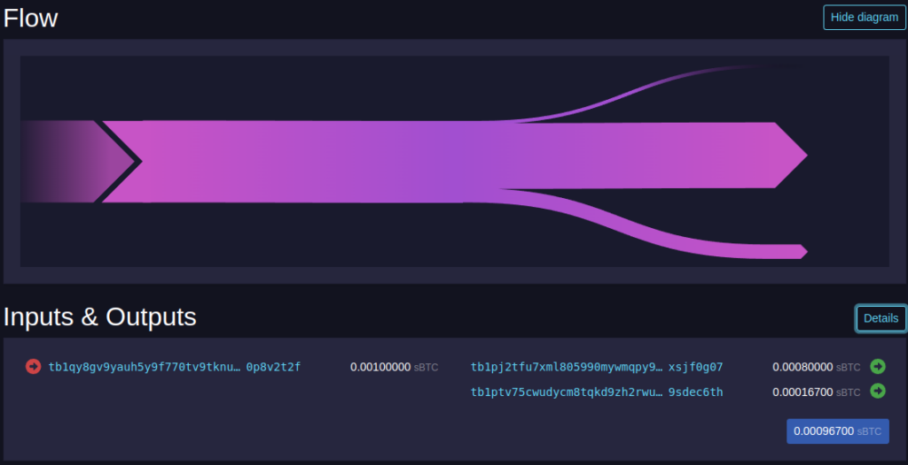

In March of 2022 Ruben Somsen proposed “[Silent Payments](https://gist.github.com/RubenSomsen/c43b79517e7cb701ebf77eec6dbb46b8),” a new approach to reusable payment codes that removes the need for a notification transaction (the major drawback of [BIP 47 payment codes](/docs/comparing-proposals/bip47)) by entirely leveraging information that was already in the transaction to signal to the recipient when funds are intended for them. Silent Payments make use of advances in Bitcoin scanning to remove the need for a notification transaction, thereby improving scaling and privacy associated with reusable payment codes (with a key trade-off we’ll address later).

### How they work

A Silent Payment address is really just two public keys glued together: a *scan* key and a *spend* key. When Alice goes to send funds to Bob, her wallet takes the private keys of the coins she's spending and combines them with Bob's scan public key to create a shared secret using [ECDH](https://en.wikipedia.org/wiki/Elliptic-curve_Diffie%E2%80%93Hellman). Only Alice (who knows her input keys) and Bob (who knows his scan private key) can ever calculate this secret. Alice's wallet then uses that shared secret to tweak Bob's spend public key, creating a unique one-time Taproot address that only Bob can spend from. Because the secret depends on the exact coins Alice is spending, every payment lands at a brand-new address, allowing Alice to generate practically infinite addresses without any communication with Bob. The resulting unique, one-time Taproot address makes the payment appear exactly like any other Taproot payment on-chain, thereby preventing an outside observer from even knowing Silent Payments were used at all, much less link payments to a specific Silent Payment address.

When Bob wants to check for received funds, he looks on chain for a potential Silent Payments transaction, adds up the public keys of its inputs, and combines that with the private scan key of his Silent Payment address. If the combination matches an output of that transaction, he can spend it. If not, he can ignore that transaction and move on to the next, until he has scanned the entire set of potential Silent Payment UTXOs.

What a Silent Payment address looks like off-chain:

`sp1qqweplq6ylpfrzuq6hfznzmv28djsraupudz0s0dclyt8erh70pgwxqkz2ydatksrdzf770umsntsmcjp4kcz7jqu03jeszh0gdmpjzmrf5u4zh0c`

What a Silent Payment address looks like on-chain (i.e. any Taproot address):

`bc1pftjlgdq0ufhq7qwd0atxhrjhlnpmc8v4x50tgytygzk5rz339u6qngunq4`


  Do not reuse or share the generated on-chain Taproot address (`bc1p...`) as a receive address. Only the Silent Payment address (`sp1...`) is reusable. Funds sent directly to a generated Taproot address may not be detected by Silent Payment wallet scanning.



  Note that the addresses above are real-world examples, with the Taproot address actually being used in a payment to the above Silent Payment address.

  Every payment to the above Silent Payment address would look like a new, entirely disconnected Taproot address to outside observers!


### Trade-offs

Because Bob cannot pre-generate addresses with silent payments, he needs to keep checking to find new payments from the point he generated the payment code. Because this scanning is relatively costly, Silent Payments wallets need more compute and bandwidth than a standard wallet talking to an Electrum server. Most light wallets today connect to a new type of server that serves the necessary "tweak" data for a wallet to check each potential transaction for themselves.

The key difference with Silent Payment scanning is that instead of pre-generating a large amount of addresses up front like with a standard BIP 32 light client, Silent Payments requires the wallet to download 33 bytes of "tweak" data per eligible transaction and then perform an ECDH calculation to check if any of its outputs belong to the user. The major benefit to this approach is that it provides excellent privacy (even for light wallets), as the tweak server hands the exact same data to everyone and never learns which outputs belong to any light client.

Even though this may sound like a major hit to user experience, thankfully we can already drastically improve sync performance by ruling out potential outputs like:

1. Non-Taproot outputs
2. Taproot "dust" outputs under ~1,000 sats, which most wallets skip by default. These outputs aren't worth spending at today's fees anyway, and filtering them out removes a huge amount of scanning work from things like Ordinals and Runes spam ([as Josie Baker notes](https://github.com/josibake/bitcoin-data-analysis/blob/main/notebooks/silent-payments-light-client-data.ipynb), a wallet can always rescan without the filter later if it needs to)
3. All potential Silent Payments outputs that have already been spent (known as "cut-through")

These two simple filters make a massive difference. Measured across every block since Taproot activation, cut-through alone shrinks the data a light wallet needs to download for a full restore from ~15 GB to ~3.4 GB, and adding a 1,000 sat dust filter on top brings it all the way down to under 0.5 GB -- about 97% less data than checking everything ([source](https://delvingbitcoin.org/t/silent-payments-light-client-protocol/891/17)).

Additionally, there are many brilliant people working on reducing the impact of this trade-off through things like tweak servers that already handle cut-through and dust filtering, a Silent Payments module in [libsecp256k1](https://github.com/bitcoin-core/secp256k1/pull/1765), and [Silent Payments support landing in Bitcoin Core itself](https://github.com/bitcoin/bitcoin/issues/28536).

Some wallets have also started offering a different trade-off entirely: handing your scan key to a server that does all the scanning for you. It's much faster, and while it's still a big privacy upgrade over reusing an address, it does mean trusting that server. I dig into all of the different scanning approaches (and what each one reveals about you) in [How Silent Payment Wallets Scan](/docs/scanning).

## Further reading

Want to do a deeper dive into Silent Payments? Read on below for more resources:

- [Silent Payments Bitcoin Improvement Proposal - 352](https://github.com/bitcoin/bips/blob/master/bip-0352.mediawiki)
- ["How Silent Payments Are Bringing New Privacy Protections To Bitcoin" - Bitcoin Magazine](https://bitcoinmagazine.com/technical/silent-payments-make-bitcoin-more-private)
- [Bitcoin, Explained Ep. 58 - Silent Payments](https://www.youtube.com/watch?v=42PMLaz7Avk&t=20s)
- ["Making sense of stealth addresses" - Foundation.xyz](https://foundation.xyz/blog/making-sense-of-stealth-addresses)
- [Silent Payments - Bitcoin Optech](https://bitcoinops.org/en/topics/silent-payments/)
- ["Silent Payments" - LearnBitcoin glossary](https://www.learnbitcoin.com/glossary/silent-payments)
- [Silent payments - Bitcoin Design Guide](https://bitcoin.design/guide/how-it-works/silent-payments/)
- ["Understanding Silent Payments" - BitBox Blog](https://blog.bitbox.swiss/en/understanding-silent-payments-part-one/)
- [Silent Payments workshop - josibake](https://github.com/josibake/silent-payments-workshop)
